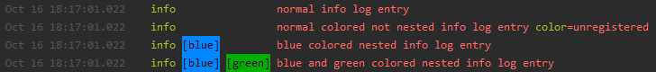

# Colored Nested Logrus Formatter
[](https://goreportcard.com/report/github.com/DaRealFreak/colored-nested-formatter)

Human readable log formatter for the logrus library. Option to define custom colors for specific field matches.

## Usage
You can either register it for every log or create your new log instance and use the SetFormatter function of the logrus Log.

Example code:

```go
package main

import (
	formatter "github.com/DaRealFreak/colored-nested-formatter"
	"github.com/sirupsen/logrus"
	"time"
)

func main() {
	log := logrus.New()
	log.SetFormatter(&formatter.Formatter{
		DisableColors:            false,
		ForceColors:              false,
		DisableTimestamp:         false,
		UseUppercaseLevel:        false,
		UseTimePassedAsTimestamp: false,
		TimestampFormat:          time.StampMilli,
		PadAllLogEntries:         true,
	})

	formatter.AddFieldMatchColorScheme("color", &formatter.FieldMatch{
		Value: "blue",
		Color: "232:33",
	})
	formatter.AddFieldMatchColorScheme("moreColorFields", &formatter.FieldMatch{
		Value: "green",
		Color: "232:34",
	})

	log.Info("normal info log entry")
	log.WithField("color", "unregistered").Infof("normal colored not nested info log entry")
	log.WithField("color", "blue").Info("blue colored nested info log entry")
	log.WithFields(logrus.Fields{"color": "blue", "moreColorFields": "green"}).Info(
		"blue and green colored nested info log entry",
	)
}
```

The above code will output this:



## Configuration
You have multiple configuration options for the formatter for whatever use case you need it for:
```
type Formatter struct {
	// timestamp formatting, default is time.RFC3339
	TimestampFormat string
	// color schema for messages
	ColorSchema *ColorSchema
	// no colors
	DisableColors bool
	// no check for TTY terminal
	ForceColors bool
	// no timestamp
	DisableTimestamp bool
	// false -> time passed, true -> timestamp
	UseTimePassedAsTimestamp bool
	// false -> info, true -> INFO
	UseUppercaseLevel bool
	// reserves space for all log entries for all registered matches
	PadAllLogEntries bool
}
```

## Development
Want to contribute? Great!  
I'm always glad hearing about bugs or pull requests.

## License
This project is licensed under the MIT License - see the [LICENSE](LICENSE) file for details
